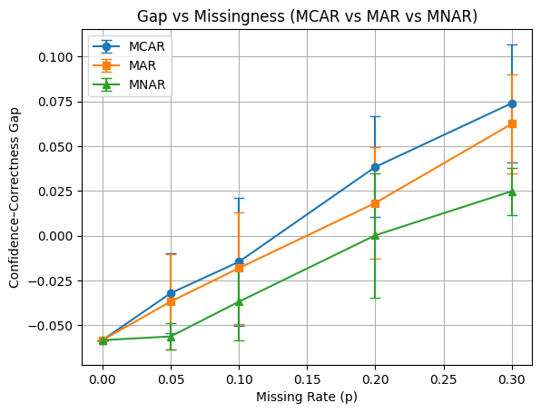

# Model Confidence vs Data Quality: A Reliability Engineering Study

## 1. Project Overview

Modern machine learning models report **confidence** in their predictions, yet in real-world environments (healthcare, finance, security), this confidence often becomes untrustworthy as data quality degrades.

This project provides a systematic, mathematical framework to test the assumption: *“If a model is confident, it is likely correct”*. Rather than building "better" models, this study focuses on **measuring trustworthiness** by observing how a model's statistical promises hold up under controlled data failure.

### The Three Laws of the Project

1. **Confidence is a Quantitative Claim:** A model's output (e.g., 0.92 probability) is treated as a statistical promise of accuracy.
2. **Correctness is Empirical:** Accuracy is defined strictly by comparison with ground truth; there is no partial credit.
3. **Reliability Must Be Tested Under Degradation:** A model is only truly reliable if its confidence remains calibrated when faced with noise, bias, or missing information.

### The Conceptual Framework

The project operates across four isolated layers to ensure scientific integrity:

* **Data Layer:** Clean, frozen datasets.
* **Degradation Layer:** Mathematical operators (Missingness, Noise, Bias) that simulate real-world failure.
* **Model Layer:** Frozen classifiers trained only on clean data.
* **Measurement Layer:** Quantifying the **Confidence–Correctness Gap** and Expected Calibration Error (ECE).

### Project Architecture: Why It Looks the Way It Does

The directory structure is not cosmetic.

Each folder enforces separation of concerns:

* `data/` → what exists
* `corruption/` → how reality degrades
* `models/` → how decisions are made
* `metrics/` → how trust is measured
* `analysis/` → how claims are validated

No folder is allowed to “cheat” by accessing another improperly.

This mirrors **scientific experimental isolation**.

### What This Project Ultimately Demonstrates

At the end, the project answers:

1. When does confidence stop being meaningful?
2. Which types of data degradation are most dangerous?
3. Can a model remain confident while being consistently wrong?
4. How early can reliability failure be detected?
5. Why accuracy alone is an inadequate safety metric?

These are **deployment-critical questions**, not academic curiosities.

### If You Had to Explain It in One Line

> *This project measures when and why machine learning models stop being honest about their own uncertainty as data quality deteriorates.*

---

## 2. Getting Started

### Prerequisites

* Python 3.9+
* Key Libraries: `numpy`, `pandas`, `scikit-learn`, `matplotlib`, `scipy`

### Installation

**1. Clone the repository:**
```bash
git clone https://github.com/amitingits/model-confidence-reliability.git
cd model-confidence-reliability
```
**2. Create Virtual Python Environment:**
```bash
python -m venv <env-name>
```
For windows
```bash
 <env-name>/Scripts/activate
```
For Linux/MacOS
```bash
 source <env-name>/bin/activate
```
Replace the `<env-name>` with your actual environment name.

**3. Install dependencies:**
```bash
pip install -r requirements.txt
```
### Running a Test

The project uses YAML configurations to manage degradation types. To run an experiment, modify the `mechanism` and `experiment_name` in the `/experiments/iris.yaml file`

```bash
# /experiments/iris.yaml 

degradation:
  type: missingness
  mechanism: MNAR   # MCAR or MAR or MNAR

output:
  directory: results/iris
  experiment_name: mnar     # MCAR or MAR or MNAR (in small letters)
```

Run `run_experiment.py` file to run the experiments.

```bash
python run_experiment.py --config experiments/iris.yaml   # MCAR (experiment_name: mcar)
python run_experiment.py --config experiments/iris.yaml   # MAR  (experiment_name: mar)
python run_experiment.py --config experiments/iris.yaml   # MNAR (experiment_name: mnar)
```
Then:
```bash
python analysis/compare_mcar_mar_mnar.py
```

To execute bootstrap analysis, run:
```bash
python analysis/bootstrap_tables.py --experiment mcar
python analysis/bootstrap_tables.py --experiment mar
python analysis/bootstrap_tables.py --experiment mnar
```
Then:
```bash
python analysis/compare_bootstrap_3way.py
```

The Experiment Results will be generated in the following directory: `/output`

---

## 3. Key Results & Analysis

The following plot demonstrates how different data degradation mechanisms (MCAR, MAR, MNAR) impact the model's reliability gap. This visual confirms that as information loss increases, the model's internal "statistical promise" (confidence) diverges from empirical reality (accuracy).



**Key Takeaways:**
* **Calibration Decay:** As data quality deteriorates, the gap between model confidence and actual accuracy expands significantly.
* **Mechanism Sensitivity:** Certain degradations, specifically **MNAR (Missing Not At Random)**, cause the model to remain dangerously overconfident despite a total collapse in accuracy.
* **The Reliability Gap:** This project quantifies the "Overconfidence Risk" that occurs when models encounter silent data degradation in production.

---

### Adding Your Own Components - Extensibility and Reusability

* **New Datasets:** The Current Project works on Iris Dataset. You can add your own datasets to the `/data` folder and update the data loader `/data/loaders.py`.
* **New Models:** Place any Scikit-Learn compatible model in the `/models` directory. The framework will automatically extract confidence scores using `.predict_proba()`.
* **Custom Degradation:** Add new functions to `/corruption`. Every function must accept a `severity` parameter () to represent the level of data decay.

### Technical Deep Dive

To understand the mathematical framework, statistical laws, and formal definitions governing this study deeply, you can definitely checkout the detailed documentation:

-> **[View the Math Behind It](./math-behind-it.md)**

### Credits & Authorship:
* **Author: Amit Das**
* **Role:** Data Science Undergraduate